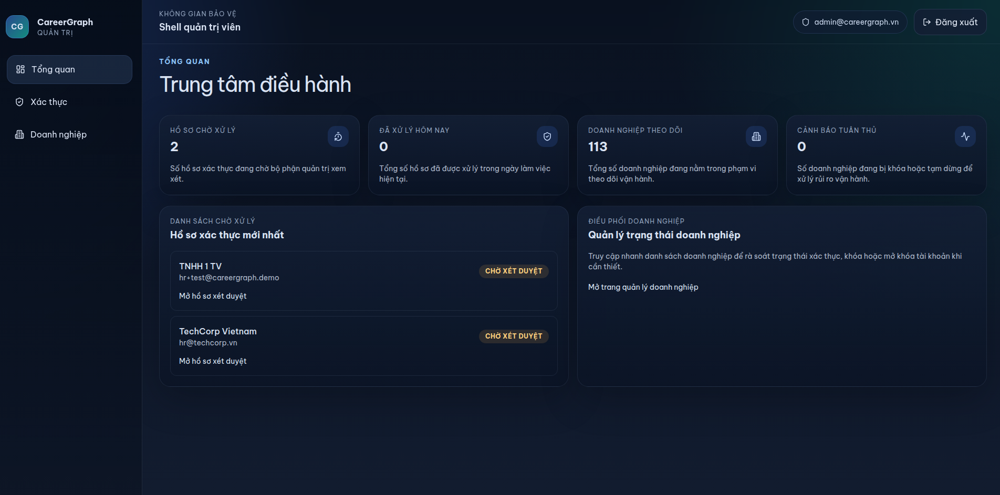
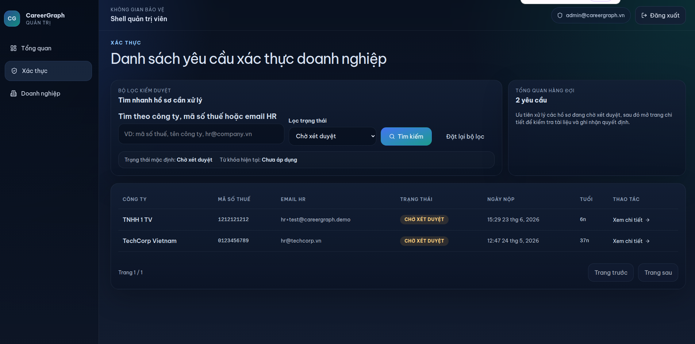
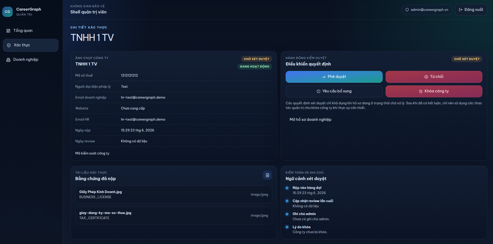

# CareerGraph Admin

CareerGraph Admin là cổng vận hành nội bộ dành cho đội ngũ kiểm soát nền tảng. Ứng dụng này tập trung vào quản trị doanh nghiệp, xét duyệt hồ sơ xác thực và theo dõi các tín hiệu rủi ro vận hành cần can thiệp ở cấp nền tảng.

## Product scope

Admin portal hiện bao gồm các module:

- dashboard vận hành
- hàng đợi xác thực doanh nghiệp
- chi tiết hồ sơ xác thực và xử lý quyết định
- danh sách doanh nghiệp cần theo dõi
- chi tiết doanh nghiệp và trạng thái quản trị

Phạm vi hiện tại phù hợp với một operational console gọn, chuyên cho governance workflows thay vì một back office đa mục đích.

## Product screens

Dashboard vận hành:



Hàng đợi xác thực doanh nghiệp:



Chi tiết hồ sơ xét duyệt:



## Responsibilities

- Tập trung và ưu tiên hồ sơ xác thực đang chờ xử lý
- Hỗ trợ phê duyệt, từ chối hoặc yêu cầu bổ sung hồ sơ
- Theo dõi các doanh nghiệp đang hoạt động trên hệ thống
- Khóa hoặc mở khóa doanh nghiệp khi phát sinh rủi ro vận hành hoặc vi phạm chính sách

## Technology

- React 19
- TypeScript
- Vite
- React Router
- TanStack Query
- Zustand
- React Hook Form
- Zod
- Tailwind CSS 4
- Axios

## Architecture

Ứng dụng được triển khai như một frontend độc lập, giao tiếp trực tiếp với `careergraph-api`. Toàn bộ dữ liệu điều hành, hàng đợi xét duyệt và trạng thái doanh nghiệp đều được lấy từ nhóm endpoint quản trị của backend Spring Boot.

Các integration chính:

- dashboard summary
- company verification queue
- verification decision workflow
- company governance actions

## Code structure

```text
src/
├── app/                  # app shell, router, providers
├── config/               # runtime configuration
├── features/
│   ├── auth/
│   ├── companies/
│   ├── company-verification/
│   └── dashboard/
├── lib/                  # http client, auth helpers
├── shared/               # layout system và shared UI
└── stores/
```

## Environment model

Cấu hình môi trường được cung cấp qua các biến `VITE_*` trong local development và qua build-time environment trong production.

Các biến quan trọng:

- `VITE_API_BASE_URL`
- `VITE_RTC_BASE_URL`
- `VITE_APP_TITLE`

Môi trường production nên được cấp qua secret manager hoặc CI/CD variables; file `.env` chỉ dùng cho local development.

## Local development

Yêu cầu:

- Node.js 20.19+ hoặc mới hơn
- npm
- `careergraph-api` đang chạy và có sẵn các endpoint quản trị

Chạy local:

```bash
npm install
npm run dev
```

Build production:

```bash
npm run build
```

## Deployment notes

- Build output là static assets từ Vite
- Production cần cấu hình `VITE_API_BASE_URL` trỏ đúng tới backend có context `/careergraph/api/v1`
- Portal này không có server-side runtime riêng; chiến lược deploy phù hợp là CDN, static hosting hoặc web server phục vụ bundle build

## Verification

- Frontend build đã hoàn tất thành công trong workspace hiện tại
- Vite vẫn build được với runtime Node hiện tại, nhưng phiên bản Node mới hơn vẫn là lựa chọn phù hợp cho môi trường phát triển và CI
